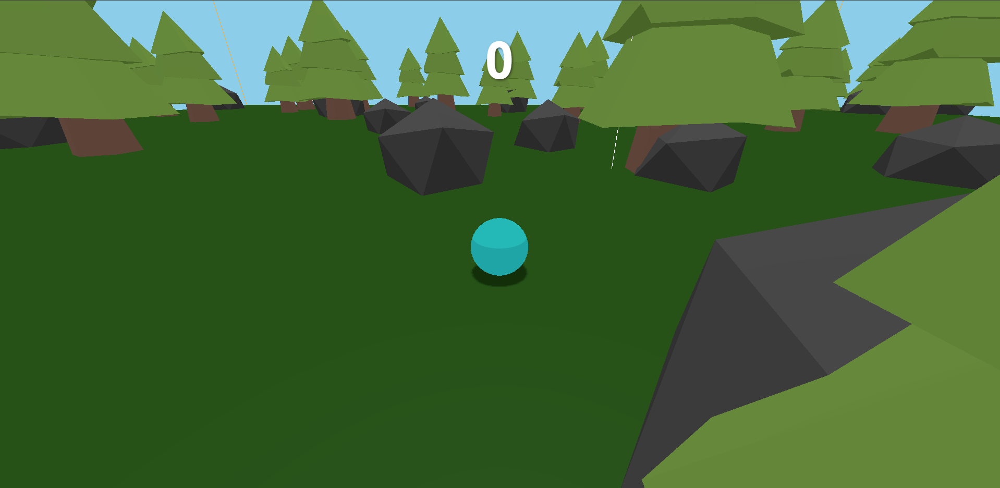

## Ball-Catcher

[live_demo](https://ball-catcher.vercel.app)

## Prérequis

- Node.js et npm installés sur votre machine.

## Installation

1. Clonez ce dépôt sur votre machine locale.
2. Naviguez vers le répertoire du projet.
3. Exécutez `npm install` pour installer les dépendances du projet.

## Lancement du Projet

1. Exécutez `npm run dev` pour lancer le projet.
2. Ouvrez votre navigateur et accédez à `http://localhost:5173`.

## Utilisation de ZzFX

Le projet utilise la bibliothèque ZzFX pour le son.